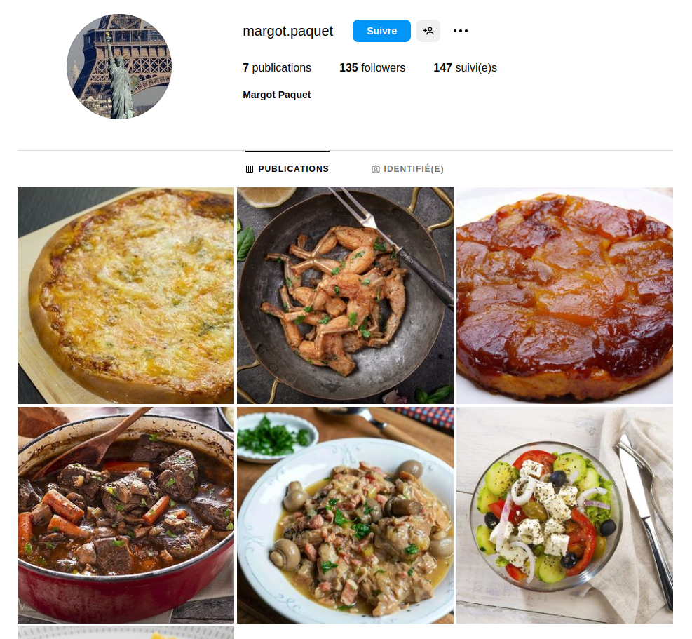
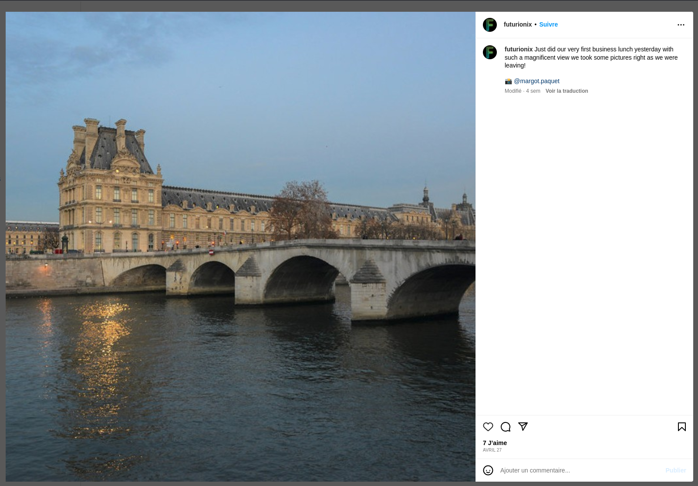
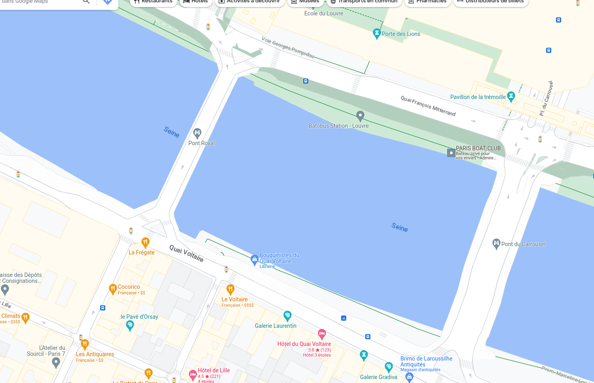
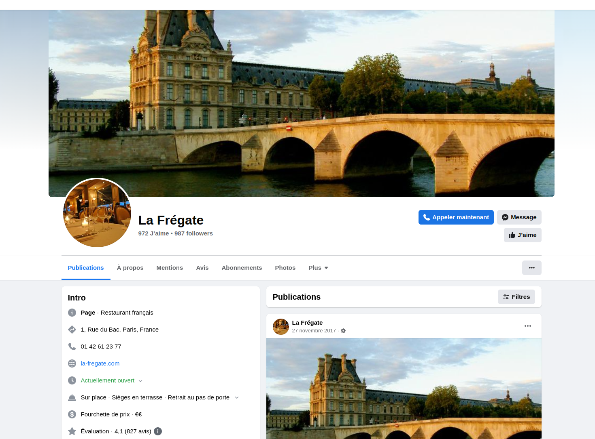
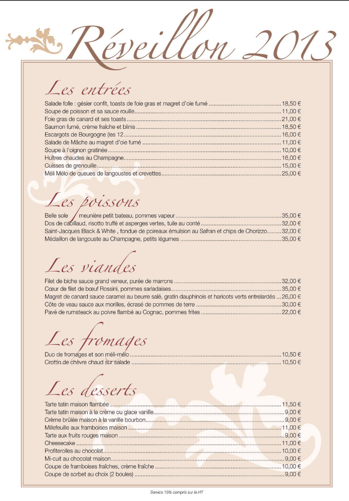

# Mentions gastronomiques
> Difficulté : Facile


## Enoncé :

*Vous entendez de l'agitation dans le café, la commissaire Anne Capestan ainsi que sa brigade des Poulets Grillés sont sur une enquête traitant d’emplois fictifs et il est nécessaire de retracer les pas des grands acteurs de cette arnaque. La brigade, qui a pourtant la réputation d'être d'une efficacité redoutable malgré les personalités fortes qui la compose, n'arrive pas à avancer dans l'enquête. Vous êtes conviés à apporter un regard nouveau à ce qui semble être une chasse à l'homme ou plutôt une chasse à la femme dans ce cas précis... La principale suspecte se prénommerait Margot Paquet, si ce n'est pas un pseudonyme... Nous savons qu’elle est allée au restaurant peu de temps avant de totalement disparaître, trouvez le nom du restaurant et le prix qu’elle y a payé pour aider l'enquête à avancer. Anne a besoin de vous, elle doit redorer son blason après sa sanction pour utilisation d'armes abusive, faites au mieux !*

*Trouvez le nom du restaurant et le prix qu’elle y a payé.*

## Solution

Nous n'avons qu'un nom, nous cherchons une certaine **Margot Paquet**, que nous cherchons en ligne (pour ma part sans succès).
Nous allons chercher plus précisément, en nous penchant sur les réseaux sociaux.
Sur instagram, nous trouvons [ce compte](https://www.instagram.com/margot.paquet/), qui semble intéressant : compte public, photos de nourriture (ce que nous cherchons a un rapport avec la nourriture), aucun post ne date de plus de quelques semaines.

<p align="center">
  
</p>

En fouillant son compte, nous constatons qu'elle a été identifiée sur une photo d'un [autre utilisateur](https://www.instagram.com/futurionix/).

Ce compte n'ayant posté que 2 photos, nous regardons la seconde photo et constatons que la légende de celle-ci mentionne un déjeuner !

<p align="center">
  
</p>

En plaçant cette photo dans Paris (nous reconnaissons les quais de Seine, ainsi que le bâtiment entre le Louvre et le jardin des Tuileries) nous nous retrouvons dans cette zone là (photo prise depuis la gauche du screenshot, mais la partie à gauche étant le musée d'Orsay, elle nous est inutile) :

<p align="center">
  
</p>

De là plusieurs options se présentent à nous, seraient soit *La Frégate*, *Le Voltaire* ou bien *Cocorico*.
Les cartes des 2 derniers restaurants ne sont pas celles que nous recherchons, car nous recherchons une carte avec des plats que l'on peut retrouver sur le compte Instagram de Margot Paquet. C'est le raisonnement que j'ai personnellement suivi, en me disant que c'était ce qui allait me permettre de trouver la somme dépensée.

Ainsi il nous reste *La Frégate*, mais la carte est difficile à trouver, les liens sont expirés ou nous redirigent vers un site tiers.
Les restaurants ayant souvent une présence sur les réseaux sociaux, nous réussissons à [les trouver](https://www.facebook.com/profile.php?id=100063678665296) sur Facebook.

<p align="center">
  
</p>

Les liens vers les sites que nous trouvons sur le compte sont eux aussi invalides, mais nous trouvons parmi les photos la photo d'une carte de **Noël 2013**.

<p align="center">
  
</p>

Pattes de canards et tarte tatin sont au menu (que nous avons trouvé sur le compte de Margot Paquet), victoire !


## Flag


<details>
<summary>🚩</summary>

```
404CTF{404CTF{la_fregate_26.50}}
```
