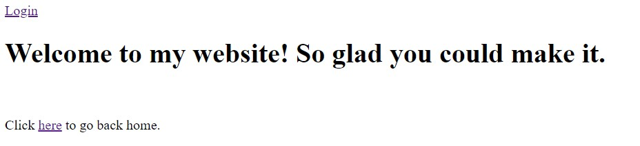

# Unsecure

## Enoncé :

*As it turns out, the admin who runs our website is quite insecure. They use password123 as their password.*
*(Wrap the flag in LITCTF{})*
*http://litctf.org:31776/*

## Solution

En naviguant sur cette page, ils nous est sommé d'aller visiter /welcome, ce que nous faisons. Nous arrivons alors sur une page de la sorte :

<p align="center">
  
</p>

Nous naviguons alors sur la page de login, et rentrons les identifiants **admin - password123**, comme il nous l'est dit dans l'énoncé.\
Nous arrivons alors sur une page wikipédia sur la **redirection**. Nous devinons qu'il y a eu quelque part une redirection. Utilisons BurpSuite afin d'y voir plus clair.

Nous voyons que nous passons par **/there_might_be_a_flag_here**, puis **/ornot**, et enfin : **/0k4y_m4yb3_1_l13d**.

Nous remarquons que l'adresse est écrite en Leet ([Leet ?](https://fr.wikipedia.org/wiki/Leet_speak)), et est notre flag.

## Flag

<details>
<summary>🚩</summary>

```
LITCTF{0k4y_m4yb3_1_l13d}
```
</details>
